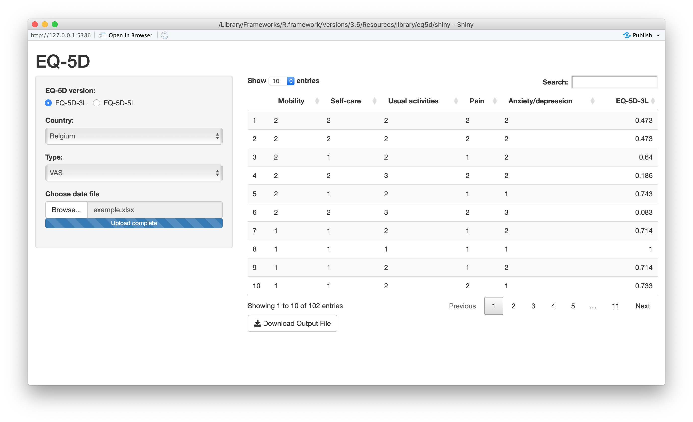

<!-- README.md is generated from README.Rmd. Please edit that file -->
<!-- badges: start -->
<!-- badges: end -->
EQ-5D
=====

EQ-5D is a one of the most popular health related quality of life instruments that can be used in the clinical and economic evaluation of health care as well as in population health surveys. Developed by the [EuroQol](https://www.euroqol.org) group, the instrument consists of two components: health state description and evaluation.

In the description component a person's health status is measured in terms of five dimensions; mobility, self-care, usual activities, pain/discomfort, and anxiety/depression. For each dimension a patient self-rates their level of severity for using a three-level ([EQ-5D-3L](https://euroqol.org/eq-5d-instruments/eq-5d-3l-about/)) or a five-level ([EQ-5D-5L](https://euroqol.org/eq-5d-instruments/eq-5d-5l-about/)) scale, generating a five digit number.

The evaluation component requires a patient to record their overall health status using a visual analogue scale (EQ-VAS).

Following assessment the five digit number from the descriptive component can be converted to an index score to compare how good or bad the patient's health state is relative to the general population of a country.

The package eq5d provides methods to calculate index scores for both EQ-5D-3L and EQ-5D-5L value sets. Additionally, a [Shiny](https://shiny.rstudio.com) app is provided to enable multiple index values to be calculated via a web browser.

Installation
------------

You can install eq5d from [GitHub](https://github.com/) with:

``` r
# install.packages("devtools")
devtools::install_github("fragla/eq5d")
```

Quick Start
-----------

``` r
library(eq5d)

#single calculation

#named vector MO, SC, UA, PD and AD represent mobility, self-care, usual activites, pain/discomfort and anxiety/depression, respectfully.
scores <- c(MO=1,SC=2,UA=3,PD=2,AD=1)

#EQ-5D-3L using the UK TTO value set
eq5d(scores=scores, country="UK", version="3L", type="TTO")
#> [1] 0.329

#multiple calculations
scores.df <- data.frame(
  MO=c(1,2,3,4,5), SC=c(1,5,4,3,2), UA=c(1,5,2,3,1), PD=c(1,3,4,3,4), AD=c(1,2,1,2,1)
)

#EQ-5D-5L using the Canadian VT value set
eq5d(scores.df, country="Canada", version="5L")
#> [1] 0.949 0.362 0.390 0.524 0.431
```

Value sets
----------

The available value sets can be viewed using the ***valuesets*** function. The results can be filtered by EQ-5D version, value set type or by country.

``` r
# Return all value sets (top 6 returned for brevity).
head(valuesets())
#>    Version Type     Country
#> 1 EQ-5D-3L  TTO     Denmark
#> 2 EQ-5D-3L  TTO     Germany
#> 3 EQ-5D-3L  TTO       Japan
#> 4 EQ-5D-3L  TTO Netherlands
#> 5 EQ-5D-3L  TTO       Spain
#> 6 EQ-5D-3L  TTO          UK

# Return VAS based value sets (top 6 returned for brevity).
head(valuesets(type="VAS"))
#>    Version Type    Country
#> 1 EQ-5D-3L  VAS    Belgium
#> 2 EQ-5D-3L  VAS    Denmark
#> 3 EQ-5D-3L  VAS     Europe
#> 4 EQ-5D-3L  VAS    Finland
#> 5 EQ-5D-3L  VAS    Germany
#> 6 EQ-5D-3L  VAS NewZealand

# Return EQ-5D-5L value sets (top 6 returned for brevity).
head(valuesets(version="5L"))
#>    Version Type   Country
#> 1 EQ-5D-5L   VT    Canada
#> 2 EQ-5D-5L   VT     China
#> 3 EQ-5D-5L   VT   England
#> 4 EQ-5D-5L   VT   Germany
#> 5 EQ-5D-5L   VT  HongKong
#> 6 EQ-5D-5L   VT Indonesia

# Return all UK value sets.
valuesets(country="UK")
#>    Version Type Country
#> 1 EQ-5D-3L  TTO      UK
#> 2 EQ-5D-3L  VAS      UK
```

Shiny web interface
-------------------

The calulation of multiple EQ-5D indices can also be performed using the packaged [Shiny](https://shiny.rstudio.com) app and requires [shiny](https://cran.r-project.org/web/packages/shiny/index.html), [DT](https://cran.r-project.org/web/packages/DT/index.html), [mime](https://cran.r-project.org/web/packages/mime/index.html) and [xlsx](https://cran.r-project.org/web/packages/xlsx/index.html) packages. The CSV/xlsx headers should be the same as the names of the vector passed to the ***eq5d*** function i.e. MO, SC, UA, PD and AD.

``` r
shiny_eq5d()
```



License
-------

This project is licensed under the MIT License - see the [LICENSE.md](https://github.com/fragla/eq5d/blob/master/LICENSE.md) file for details.
